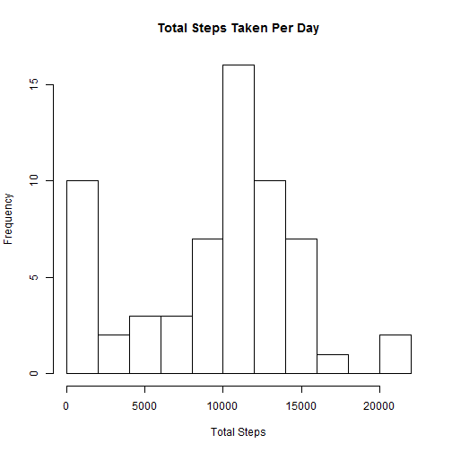
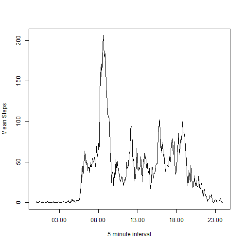
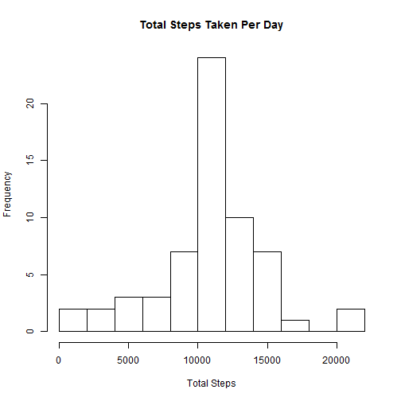

## Loading and preprocessing the data

Unpack the data archive (activity.zip) if required.


```r
csv_filename <- 'activity.csv'
if(!file.exists(csv_filename)) {
  zip_archive_filename <- 'activity.zip'
  unzip(zip_archive_filename)
}
```

Load the raw data from the CSV file of activity data.


```r
activity_data <- read.csv(csv_filename, colClasses=c('numeric', 'Date', 'integer'))
```

Summarise the loaded data.


```r
summary(activity_data)
```

```
##      steps             date               interval     
##  Min.   :  0.00   Min.   :2012-10-01   Min.   :   0.0  
##  1st Qu.:  0.00   1st Qu.:2012-10-16   1st Qu.: 588.8  
##  Median :  0.00   Median :2012-10-31   Median :1177.5  
##  Mean   : 37.38   Mean   :2012-10-31   Mean   :1177.5  
##  3rd Qu.: 12.00   3rd Qu.:2012-11-15   3rd Qu.:1766.2  
##  Max.   :806.00   Max.   :2012-11-30   Max.   :2355.0  
##  NA's   :2304
```

## What is mean total number of steps taken per day?

Calculate the total number of steps taken per day.


```r
steps_per_day <- aggregate(activity_data$steps,
                           by=list(activity_data$date), 
                           FUN=sum, na.rm=TRUE)
colnames(steps_per_day) <- c('date', 'totalSteps')
```

Make a [histogram](http://en.wikipedia.org/wiki/Histogram) of the total number 
of steps taken each day.


```r
hist(steps_per_day$totalSteps, xlab='Total Steps', 
     main='Total Steps Taken Per Day', breaks=10)
```

 

Calculate and report the mean and median of the total number of steps taken 
per day.


```r
mean(steps_per_day$totalSteps)
```

```
## [1] 9354.23
```

```r
median(steps_per_day$totalSteps)
```

```
## [1] 10395
```

## What is the average daily activity pattern?

Make a time series plot (i.e. type = "l") of the 5-minute interval (x-axis) and 
the average number of steps taken, averaged across all days (y-axis).


```r
# Mean steps per interval.
steps_per_interval <- aggregate(activity_data$steps, 
                                by=list(activity_data$interval), 
                                FUN=mean, na.rm=TRUE)
# Update column names.
colnames(steps_per_interval) <- c('interval', 'meanSteps')
# Convert intervals into a time series.
steps_per_interval$interval_time <- strptime(
  sprintf('%04d', steps_per_interval$interval), 
  format='%H%M')
# Plot the mean steps against the time series.
plot(steps_per_interval$interval_time, steps_per_interval$meanSteps, type='l',
     xlab='5 minute interval', ylab='Mean Steps')
```

 

Which 5-minute interval, on average across all the days in the dataset, 
contains the maximum number of steps?


```r
max_steps_interval <- steps_per_interval$interval[
  steps_per_interval$meanSteps == max(steps_per_interval$meanSteps)]
max_steps_interval
```

```
## [1] 835
```

```r
# Output the interval in time format instead of as a number.
strftime(steps_per_interval$interval_time[
  steps_per_interval$interval == max_steps_interval], 
  format='%H:%M')
```

```
## [1] "08:35"
```

## Imputing missing values

Note that there are a number of days/intervals where there are missing values 
(coded as NA). The presence of missing days may introduce bias into some 
calculations or summaries of the data.

Calculate and report the total number of missing values in the dataset (i.e. 
the total number of rows with NAs)


```r
sum(!complete.cases(activity_data))
```

```
## [1] 2304
```

Devise a strategy for filling in all of the missing values in the dataset. The 
strategy does not need to be sophisticated. For example, you could use the 
mean/median for that day, or the mean for that 5-minute interval, etc.

Create a new dataset that is equal to the original dataset but with the 
missing data filled in.


```r
# Copy source data.frame.
imput_activity_data <- activity_data
# Define function to replace NA values for 'steps' with the mean number of 
# steps for the time interval.
imput_steps <- function(steps, interval) {
  retVal <- steps
  if(is.na(steps)) {
    retVal <- steps_per_interval$meanSteps[steps_per_interval$interval == interval]
  }
  return(retVal)
}
# Apply the imputation function to the data.
imput_activity_data$steps <- mapply(imput_steps, activity_data$steps, activity_data$interval)
# Report a summary for the modified data.
summary(imput_activity_data)
```

```
##      steps             date               interval     
##  Min.   :  0.00   Min.   :2012-10-01   Min.   :   0.0  
##  1st Qu.:  0.00   1st Qu.:2012-10-16   1st Qu.: 588.8  
##  Median :  0.00   Median :2012-10-31   Median :1177.5  
##  Mean   : 37.38   Mean   :2012-10-31   Mean   :1177.5  
##  3rd Qu.: 27.00   3rd Qu.:2012-11-15   3rd Qu.:1766.2  
##  Max.   :806.00   Max.   :2012-11-30   Max.   :2355.0
```

Make a histogram of the total number of steps taken each day and Calculate and 
report the mean and median total number of steps taken per day.


```r
steps_per_day <- aggregate(imput_activity_data$steps, 
                           by=list(imput_activity_data$date), 
                           FUN=sum, na.rm=TRUE)
colnames(steps_per_day) <- c('date', 'totalSteps')
hist(steps_per_day$totalSteps, xlab='Total Steps', 
     main='Total Steps Taken Per Day', breaks=10)
```

 

```r
mean(steps_per_day$totalSteps)
```

```
## [1] 10766.19
```

```r
median(steps_per_day$totalSteps)
```

```
## [1] 10766.19
```

Do these values differ from the estimates from the first part of the assignment?

What is the impact of imputing missing data on the estimates of the total daily 
number of steps?

## Are there differences in activity patterns between weekdays and weekends?

For this part the weekdays() function may be of some help here. Use the dataset 
with the filled-in missing values for this part.

Create a new factor variable in the dataset with two levels - "weekday" and 
"weekend" indicating whether a given date is a weekday or weekend day.


```r
# NB. Using day numbers to avoid locale issues with day names.
day_num <- strftime(imput_activity_data$date, format='%w')
imput_activity_data$weekday <- as.factor(
  ifelse((day_num == 0 | day_num == 6), 'weekend', 'weekday')
)
summary(imput_activity_data)
```

```
##      steps             date               interval         weekday     
##  Min.   :  0.00   Min.   :2012-10-01   Min.   :   0.0   weekday:12960  
##  1st Qu.:  0.00   1st Qu.:2012-10-16   1st Qu.: 588.8   weekend: 4608  
##  Median :  0.00   Median :2012-10-31   Median :1177.5                  
##  Mean   : 37.38   Mean   :2012-10-31   Mean   :1177.5                  
##  3rd Qu.: 27.00   3rd Qu.:2012-11-15   3rd Qu.:1766.2                  
##  Max.   :806.00   Max.   :2012-11-30   Max.   :2355.0
```

Make a panel plot containing a time series plot (i.e. type = "l") of the 
5-minute interval (x-axis) and the average number of steps taken, averaged 
across all weekday days or weekend days (y-axis). See the 
[README file](https://github.com/rdpeng/RepData_PeerAssessment1/blob/master/README.md) 
in the [GitHub repository](https://github.com/rdpeng/RepData_PeerAssessment1/) 
to see an example of what this plot should look like using simulated data.


```r
steps_per_interval <- aggregate(imput_activity_data$steps, 
                                by=list(
                                  imput_activity_data$weekday,
                                  imput_activity_data$interval
                                        ), 
                                FUN=mean, na.rm=TRUE)
colnames(steps_per_interval) <- c('weekday', 'interval', 'meanSteps')
# Plot using lattice.
library(lattice)
xyplot(meanSteps ~ interval | weekday, steps_per_interval, 
       type='l', layout=c(1,2))
```

 

Notice that the graph has issues due to 'interval' being a set of times 
denoting intervals, and thus there are no values for the between 55 and 00 for 
each hour. To correct this a time based series needs to be used for the 
intervals.


```r
# Convert intervals to times.
steps_per_interval$interval_time <- strptime(
  sprintf('%04d', steps_per_interval$interval), 
  format='%H%M')
# Lattice has issues with POSIXlt date/time objects so use POSIXct objects.
steps_per_interval$interval_time <- as.POSIXct(steps_per_interval$interval_time)

# Plot the data using the time series.
x_ticks <- seq(from=min(steps_per_interval$interval_time), 
               to=max(steps_per_interval$interval_time), 
               by='3 hour')
xyplot(meanSteps ~ interval_time | weekday, steps_per_interval, 
       type='l', layout=c(1,2), 
       scales=list(x=list(
         at=as.numeric(x_ticks),
         labels=format(x_ticks, "%H:%M")
         ))
       )
```

 
